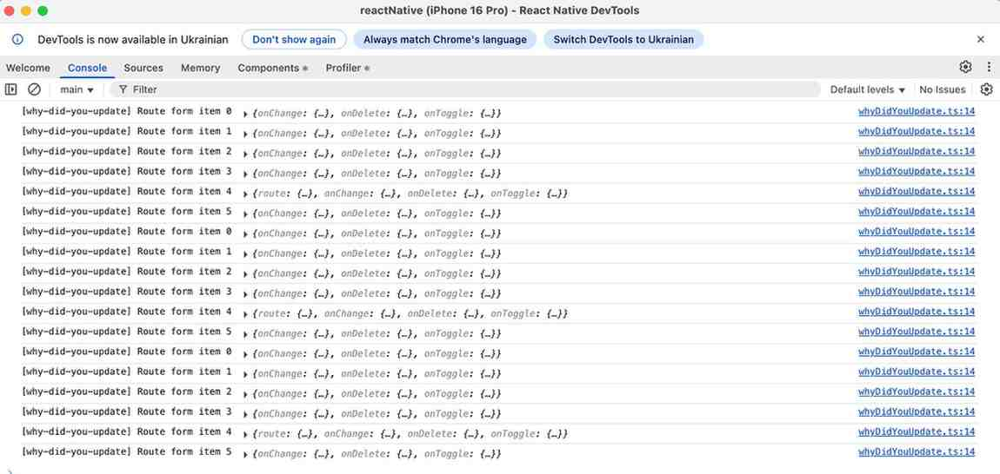
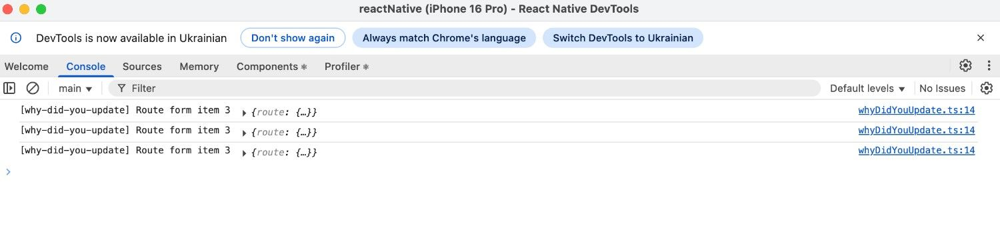
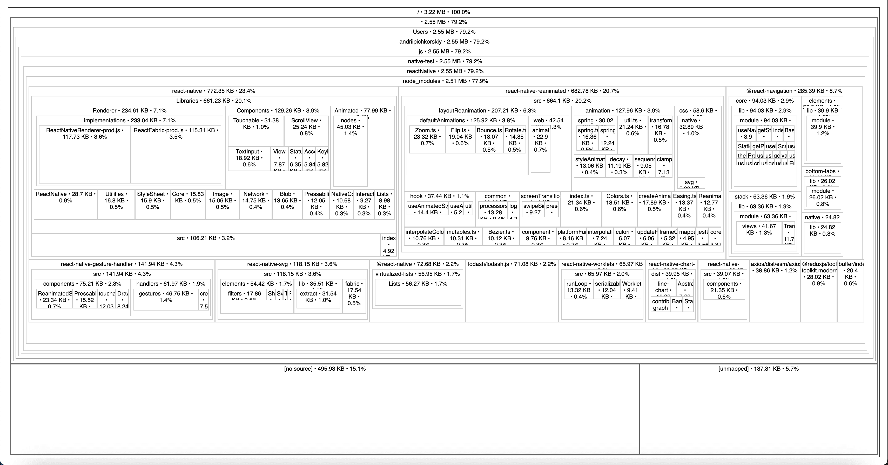
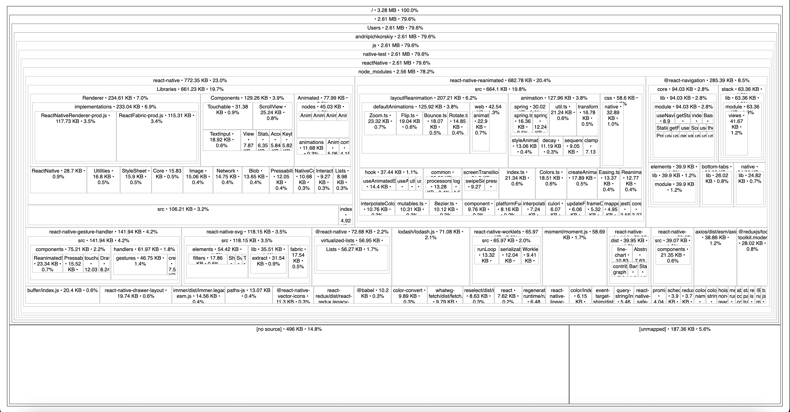

# React Native Krok App

## Demonstrating of using react-native-reanimated

### FlatList Optimization

This project showcases critical performance improvements for list rendering:

**Techniques Used:**

- `useCallback` for memoizing FlatList render functions
- `useCallback` for memoizing event handlers and callbacks

### Before vs After Optimization

| Before                                                                                      | After                                                                                     |
| ------------------------------------------------------------------------------------------- | ----------------------------------------------------------------------------------------- |
|  |  |
| **Issue**: Changing one item triggers re-render of entire list                              | **Solution**: Only the modified item re-renders                                           |

## Bundle Size Analysis with moment.js

This project demonstrates how external dependencies affect bundle size using source-map-explorer analysis.

### Bundle Size Comparison

| Without moment.js                                                                                         | With moment.js                                                                                       |
| --------------------------------------------------------------------------------------------------------- | ---------------------------------------------------------------------------------------------------- |
|  |  |
| **Size**: 3.22 MB                                                                                        | **Size**: 3.28 MB                                                                                   |

**Impact**: Adding moment.js increased bundle size by **60KB** (+1.9%), demonstrating how even popular libraries can affect application size.

**Analysis Tools Used:**
- `source-map-explorer` with Metro bundler
- `--no-border-checks` flag to resolve React Native source map compatibility issues

**Key Findings:**
- Metro's tree-shaking effectively minimizes unused code
- Even with multiple moment.js function calls, the impact is relatively small due to smart bundling
- Modern bundlers are efficient at including only necessary code paths
