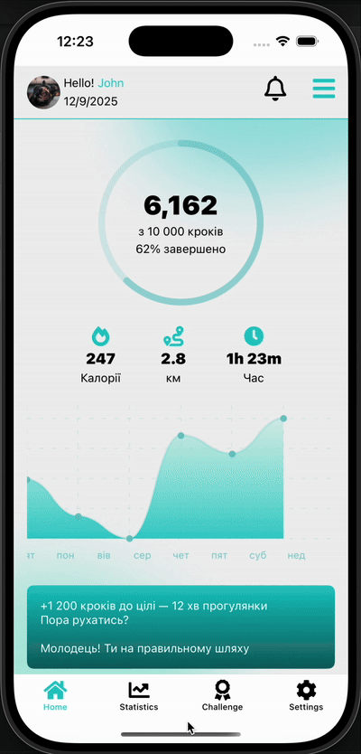
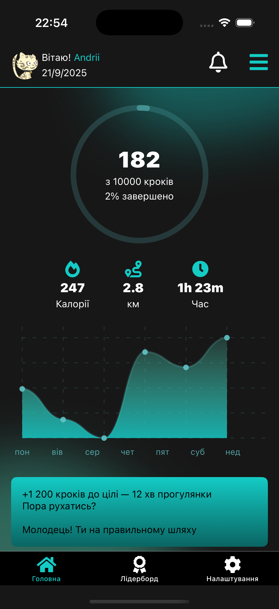
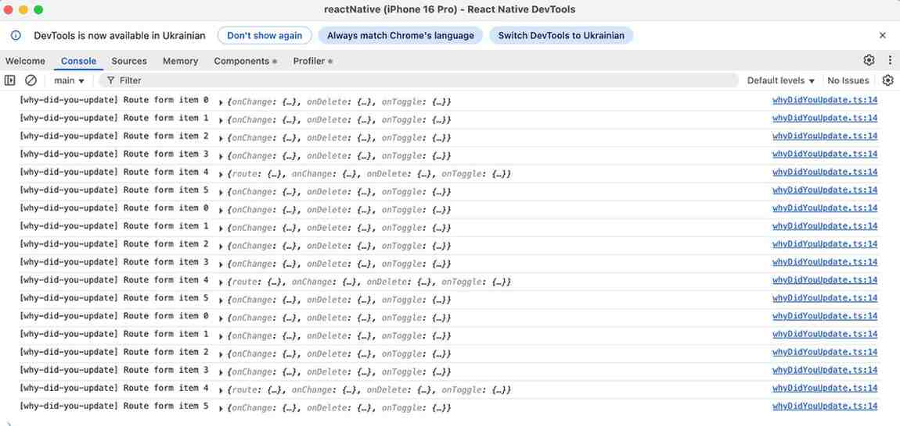
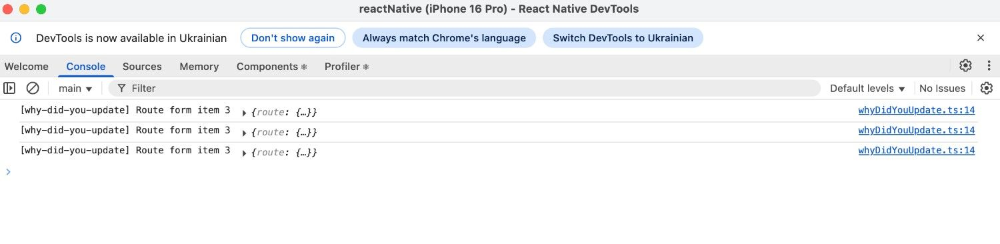
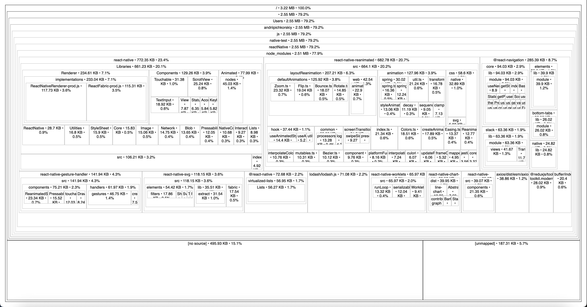
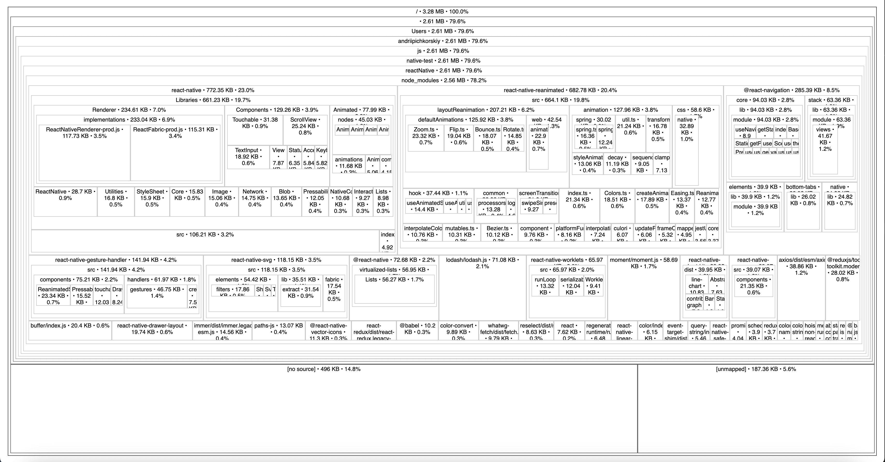

# React Native Krok App

## Фінальна робота

**Автор:** Андрій Пічкорський

Мобільний додаток для відстеження фізичної активності з використанням сучасних технологій React Native. Цей проект демонструє комплексне застосування мобільних технологій, включаючи роботу з сенсорами, системи авторизації, управління станом та оптимізацію продуктивності.



## 📱 Огляд проекту

Krok App - це мобільний додаток для трекінгу активності, який включає:

- Автоматичне відстеження кроків через акселерометр
- Систему авторизації та профілів користувачів
- Статистику та візуалізацію прогресу
- Систему викликів та лідерборди
- Налаштування маршрутів та планування активності
- Адаптивну темну/світлу тему

## 🚀 Ключові функції

### 📊 **Відстеження активності**

- Покроковий лічильник з використанням акселерометра (react-native-sensors)
- Автоматичне збереження прогресу в режимі реального часу
- Синхронізація з сервером кожну хвилину
- Візуалізація статистики через графіки (react-native-chart-kit)

### 🔐 **Система авторизації**

- Реєстрація та вхід користувачів через Supabase
- Безпечне збереження токенів та сесій
- Профілі користувачів з персональними налаштуваннями

### 🧭 **Навігаційна система**

- **Stack Navigation** - для основних переходів між екранами
- **Tab Navigation** - для швидкого доступу до головних розділів
- **Drawer Navigation** - для додаткових налаштувань та функцій

### 🎨 **Система тем**

- Підтримка світлої та темної тем
- Збереження налаштувань через AsyncStorage
- Адаптивні компоненти з автоматичним перемиканням кольорів

### ⚡ **Управління станом**

- **Redux Toolkit** для глобального стану додатку
- **Context API** для локальних станів (теми, завантаження)
- Оптимізовані селектори та мемоізація

### 🛠 **TypeScript та якість коду**

- Типізація всього проекту
- Кастомні хуки для логіки (useStepCounter, whyDidYouUpdate)
- ESLint та Prettier для стандартизації коду

## 🏗 Технічні рішення

### Архітектура проекту

```
src/
├── components/          # Переиспользуемые UI компоненты
├── screens/            # Экраны приложения
├── navigation/         # Настройка навигации
├── redux/             # Управление состоянием
├── context/           # React Context провайдеры
├── hooks/             # Кастомные хуки
├── constants/         # Константы и конфигурация
└── api/              # Интеграция с backend
```

### Обґрунтування технологічних рішень:

**React Native Sensors** - для точного відстеження кроків через акселерометр з фільтрацією шуму

**Supabase** - як backend-as-a-service для швидкої реалізації авторизації та зберігання даних

**Redux Toolkit** - для централізованого управління станом з мінімальним шаблонним кодом

**React Navigation v6** - для складної навігаційної структури з підтримкою різних типів навігації

**TypeScript** - для типобезпеки та кращої підтримки коду в команді

## 📱 Скріншоти застосунку

### Головний екран



### Список маршрутів


### Налаштування


### Лідерборд


## 🔧 Налаштування та запуск

### Встановлення залежностей

```bash
npm install
# або
yarn install
```

### Запуск на Android

```bash
npm run android
```

### Запуск на iOS

```bash
npm run ios
```

### Збірка для production

```bash
# Android
npm run bundle:android

# iOS
npm run bundle:ios
```

### Аналіз розміру bundle

```bash
npm run analyze:source-map
```

## ⚡ Оптимізація продуктивності

### FlatList Optimization

Цей проект демонструє критичні покращення продуктивності для рендерингу списків:

**Використані техніки:**

- `useCallback` для мемоізації функцій рендерингу FlatList
- `useCallback` для мемоізації обробників подій та колбеків
- Оптимізація re-рендерів через правильну структуру компонентів

### До та після оптимізації

| До оптимізації                                                                              | Після оптимізації                                                                         |
| ------------------------------------------------------------------------------------------- | ----------------------------------------------------------------------------------------- |
|  |  |
| **Проблема**: Зміна одного елемента викликає ре-рендер всього списку                        | **Рішення**: Перерендериться тільки модифікований елемент                                 |

## 📊 Аналіз розміру bundle з moment.js

Цей проект демонструє, як зовнішні залежності впливають на розмір bundle з використанням аналізу source-map-explorer.

### Порівняння розміру Bundle

| Без moment.js                                                                                           | З moment.js                                                                                       |
| ------------------------------------------------------------------------------------------------------- | ------------------------------------------------------------------------------------------------- |
|  |  |
| **Розмір**: 3.22 MB                                                                                     | **Розмір**: 3.28 MB                                                                               |

**Вплив**: Додавання moment.js збільшило розмір bundle на **60KB** (+1.9%), що демонструє вплив навіть популярних бібліотек на розмір додатку.

**Використані інструменти аналізу:**

- `source-map-explorer` з Metro bundler
- `--no-border-checks` флаг для розв'язання проблем сумісності source map в React Native

**Ключові висновки:**

- Tree-shaking Metro ефективно мінімізує невикористаний код
- Навіть з множинними викликами функцій moment.js, вплив відносно малий завдяки розумному бандлінгу
- Сучасні bundler ефективно включають тільки необхідні шляхи коду

## 🏗️ Збірка та деплой

### Production збірка для Android

Проект налаштований для створення підписаних APK файлів для production:

```bash
# Генерація bundle для Android
npm run bundle:android

# Збірка підписаного APK (налаштовано в android/app/build.gradle)
cd android && ./gradlew assembleRelease
```

**Особливості збірки:**

- Мінімізація JavaScript коду
- Оптимізація ресурсів та зображень
- Підписання сертифікатом для публікації в Google Play
- Генерація source maps для відлагодження в production

### 📦 Готова збірка для завантаження

Підписаний APK файл для Android доступний у **Git Releases**:

```bash
# Завантаження найновішої збірки
git fetch --tags
git checkout tags/v1.0.0  # або остання доступна версія

# Переглянути всі доступні теги/релізи
git tag -l
```

**Альтернативно:** Завантажте APK файл безпосередньо з розділу [Releases](../../releases) цього репозиторію.

**Системні вимоги:**

- Android 7.0 (API level 24) або новіший
- Мінімум 2 ГБ RAM
- 100 МБ вільного місця на пристрої
