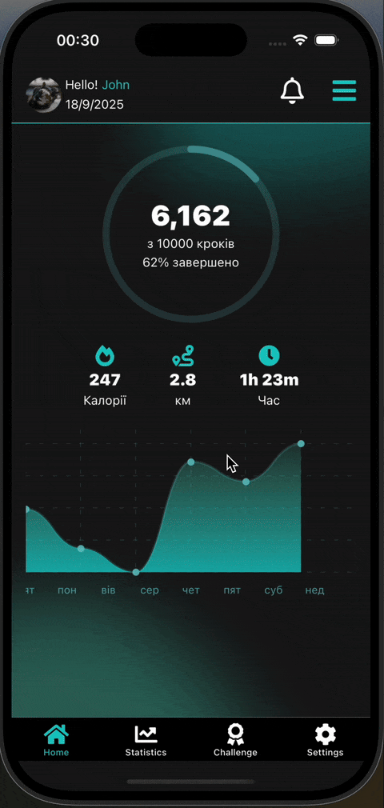

# React Native Krok App

## Demonstrating of using react-native-reanimated

### FlatList Optimization

This project showcases critical performance improvements for list rendering:

**Techniques Used:**

- `useCallback` for memoizing FlatList render functions
- `useCallback` for memoizing event handlers and callbacks

### Before vs After Optimization

| Before                                                                                      | After                                                                                     |
| ------------------------------------------------------------------------------------------- | ----------------------------------------------------------------------------------------- |
|  |  |
| **Issue**: Changing one item triggers re-render of entire list                              | **Solution**: Only the modified item re-renders                                           |
